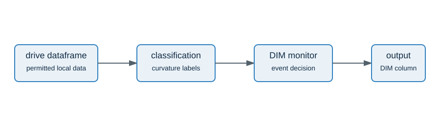

# Data contract

`DimMonitor.run` accepts one pandas dataframe per drive. By default, it expects these
columns:

| Signal | Default column | Unit |
| --- | --- | --- |
| timestamp | `timestamp` | seconds |
| vehicle velocity | `velocity_kmph` | km/h |
| acceleration | `acceleration_mps2` | m/s² |
| steering moment | `steering_moment_nm` | Nm |
| steering angle | `steering_angle_deg` | degrees |
| lane departure warning | `lane_departure_warning` | binary state |
| left and right curvature | `curvature_left_radpm`, `curvature_right_radpm` | rad/m |

Configure other names with `SignalColumns`. The repository intentionally excludes raw
drives, vehicle identifiers, session identifiers, generated reports, and credentials.

