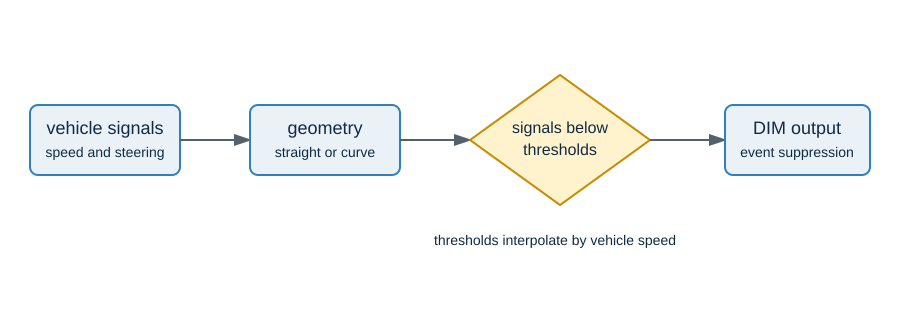

# Method overview

DIM evaluates whether a lane-keeping-assist intervention is likely aligned with driver
intent. The migrated implementation follows the thesis prototype workflow:

1. prepare timestamped vehicle signals
2. classify each sample as straight road or curve from lane-marking curvature
3. derive steering-angle velocity
4. compare acceleration and geometry-specific steering signals with speed-dependent
   thresholds
5. emit one DIM suppression decision at the beginning of each intervention event

The accompanying experiment utilities retain the thesis approach to rolling features,
frequency transforms, random forests, linear support-vector machines, logistic
regression, and soft voting. They use an explicit pre-event anticipation target rather
than hard-coded data paths.

The code intentionally separates signal names from the algorithm through
`SignalColumns`, so that a permitted local dataset can provide its own mappings without
committing confidential source field names or data.

Threshold configurations are required from the caller. The repository does not publish
calibrated parameters, and the implementation is not validated for production use or
vehicle control.

For privacy reasons, the values are conceptually set and do not match the actual
parameters used in the implementation.
